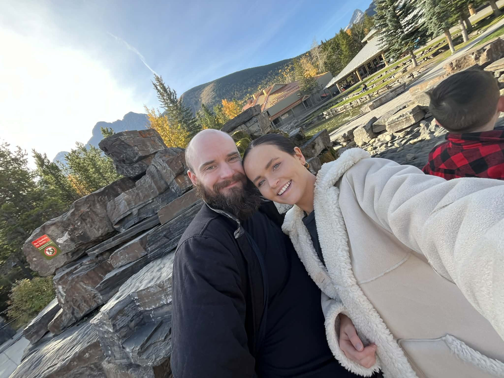
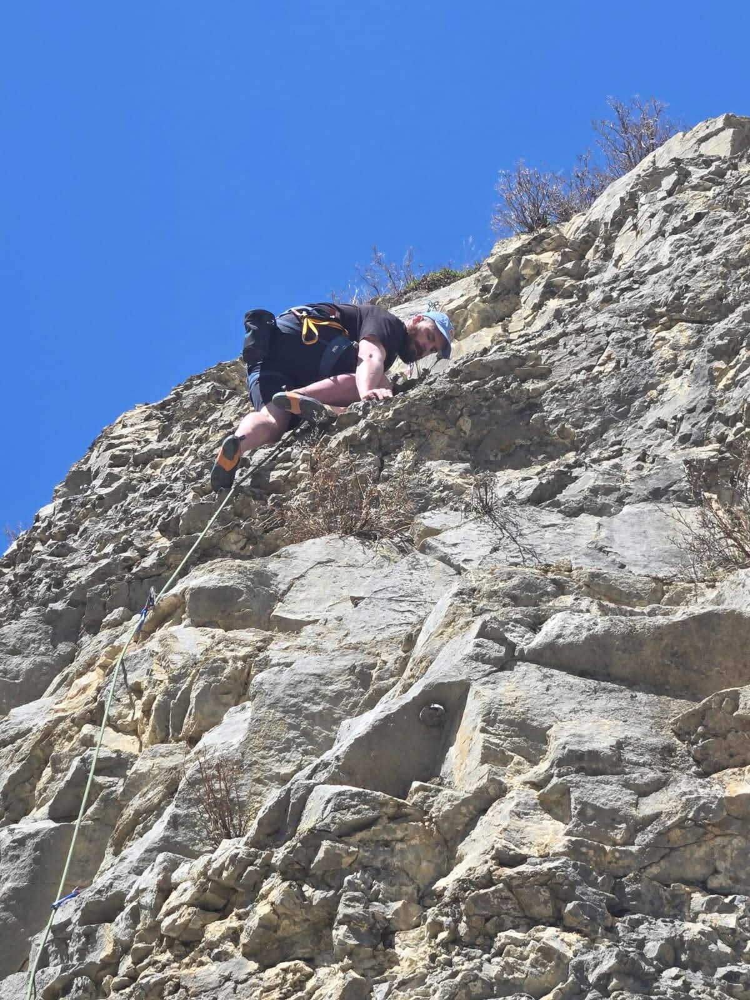
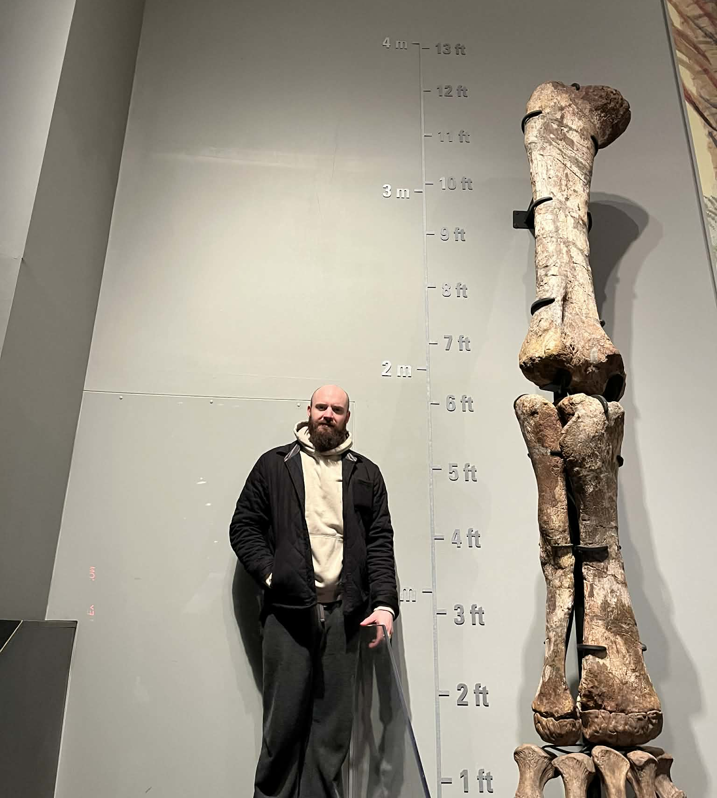
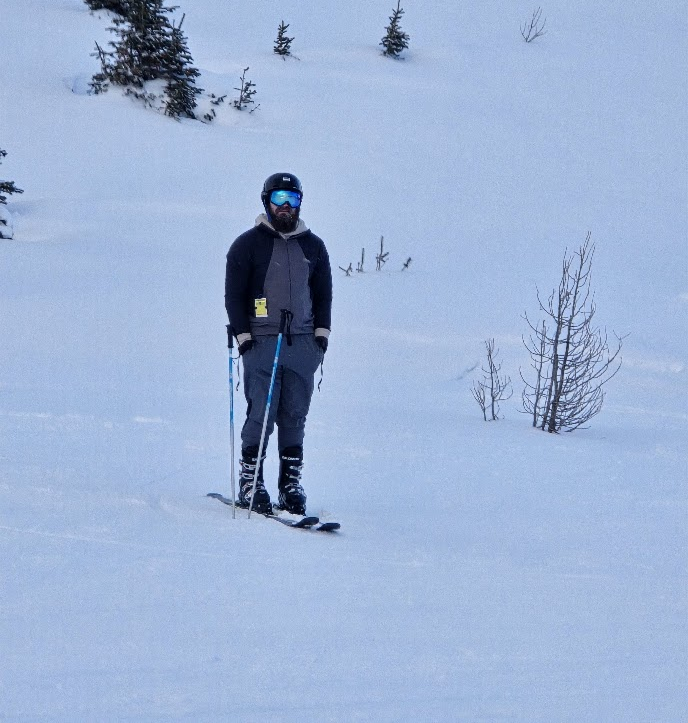
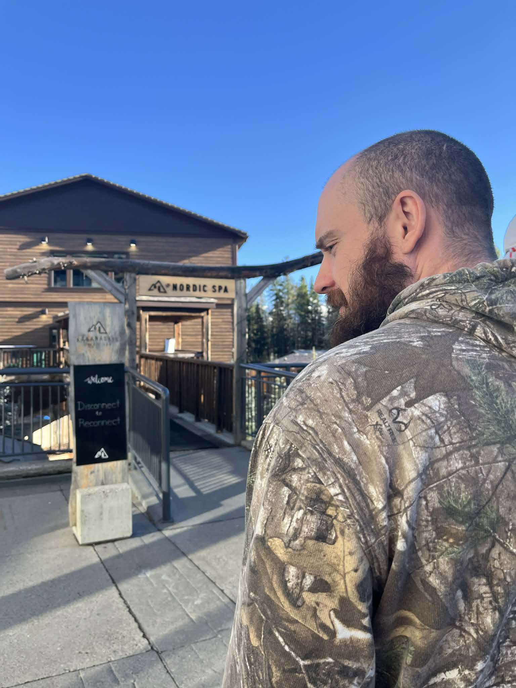

# About me

*Cooper Davies — PhD in computer science, mostly doing AI/ML and building things.*

<em>Im the one on the left</em>

I'm in Calgary, Alberta. I did my Masters and PhD under Dr. Joerg Denzinger here in Calgary while working full-time in industry. This means I've got both the academic side (Automated Machine Learning, thesis, the whole thing) and the industry side: shipping products, leading pods, and figuring out what _actually_ works.

The place that shaped me most was [**VizworX**](https://vizworx.com/) a custom solutions shop. Because every project was different, I got to touch a bit of everything: AR/VR, embedded systems, web apps, and a lot of "we need this in six weeks" kind of work. I'm grateful for that; it made me pretty comfortable picking up new stacks and domains.

These days I'm a **Senior AI Engineer** (currently at Remote Inc.), still doing full-stack and AI/ML/LLMs, RAG, the usual suspect. And I'm happy in any senior role where I get to build and ship, not just fix bugs.

--- 

## Socials

A very strange thing about me is that I don't have any socials. I don't even have a smart phone. I only recently bought a flip phone because my snowboarding friend takes forever to get to the mountain and I'm never sure if he just decided to turn around. Whenever I tell someone this they are incredibly surprised but for me I've been this way for close to a decade. Everyone agrees about how bad social media is for you and how much happier they'd be if they just got rid of their phone but apparently I'm the only person who's ever tried. It's actually **much** easier than you think.

---

## Hobbies

I rock climb and run usually with my wife. I play Magic: The Gathering with friends, usually without her.

I like teaching when I get the chance. At the [**University of Calgary**](https://www.ucalgary.ca/) I've been a sessional instructor for **CPSC 565** Emergent Computing, **DATA 311** Data Structures, and **DATA 601** Big Data Analytics.

I also like to hang out at [**Protospace**](https://protospace.ca/), where I'm one of the instrcutors for the **laser cutter**. If you're a maker in Calgary and want to cut something, come say hi.

---

## Pictures

<video src="climbing.mp4" controls width="400"></video>

<em>I always try to jumpscare one of the staff at the climbing center I go to. She hates it.</em>

<em>I like to climb outdoors. How long have I been climbing? 6 years. Am I any good at it? No.</em>

<em>I took my wife to the Royal Tyrell Museum here in Alberta. She had never been. To this day she loves dinosaurs as much as a 6 year old boy.</em>

<em>I got bored waiting for my snowboarding friend to strap in.</em>

<em>Once a year I agree to go to the nordic spa with my wife. Usually on her birthday.</em>

