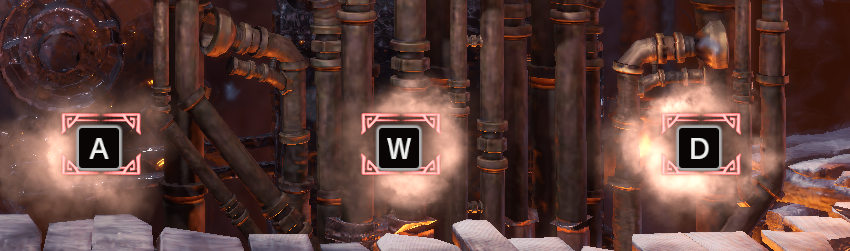

# [AutoSteamworks](https://github.com/DaviesCooper/AutoSteamworks)

*Learning decompilation and reverse engineering... And refactoring along the way.*

I love *Monster Hunter World*—I’ve put something like **700 hours** into it. So when I wanted to learn about decompilation and reverse engineering, it made sense to do it with a tool that lives inside that same game.

In *Iceborne*, the **Steamworks** is a minigame in Seliana: you spend fuel to run a machine, and each round the game shows you a sequence of three buttons (from a small set lika X, Y, Z). You have to press them in the correct order to fill a gauge and earn rewards. It’s great for stocking up on consumables and melding materials, but it’s incredibly repetitive.

At first I just tied a rubber band around my controller. However, being the engineer that I am I thought there had to be a way I could automate it. this led me to finding the **[AutoSteamworks](https://github.com/AdiBorsos/AutoSteamworks)** project. The auto steamworks is an application which reads memory from the MHW process to learn the winning button sequence, then sends the keystrokes so you don’t have to play the game yourself. I had always wanted to learn how decompiling works but I had never had sufficient reason to learn [Cheat Engine](https://www.cheatengine.org/). I also naturally didn't trust just running some random application on my desktop and so I killed two birds with one stone.

The best way to learn is to do and so I spent a week refactoring the code to a more OOP design as a way of getting hands-on usage with the exact addresses and how to abstract everything conceptually. This is how I went about it. I want to stress that this is in no way shape or form a criticism of the original author. Actually, Adi and I exchanged emails a few times discussing the project (he's a really nice guy). This was all meant to just be an excuse to learn something new.

---

## The original: one big Program and a catch-all Settings

In the pre-refactor code, almost everything lived in **`Program.cs`** (around 470 lines). The entry point did it all:

- Wrote the menu and hooked keyboard events so you could press a key to start and another to stop.
- Called `Startup()`: poll for the MHW process, wait for the user to press start, then check the game version from the window title.
- Either do the correct sequence, or do a random sequence (I didn't like this for reasons we'll get into later).
- Static fields everywhere: `mhw`, `ct`, `IsCorrectVersion`, `IsSmartRun`, `keyOrder`, `rndPatterns`, `rnd`, `api`.

Config and magic numbers lived were everywhere. This included things like the supported game version, base addresses and offsets for Steamworks and save data, delay between combo keys, log enabled, IsAzerty, key codes for start/stop/cutscene skip, and so on. Each property read from `ConfigurationManager.AppSettings` with a fallback default written inline. So “what is the default?” was scattered across many getters, and “where do we define offsets?” sat next to “what key do we use to skip cutscenes?”

---

## Step 1: Separate “what runs” from “how we start and stop”

I wanted **`Program.cs`** to only handle process lifecycle and user signals: load config, set up logging, create the thing that does the work, run it on a background thread, and react to “quit.” All the “find MHW, read sequence, send keys, check phase, skip cutscene” logic belonged somewhere else.

**How it’s done in the refactor.** I introduced **`SteamworkAutomaton`**. The automaton is the object that holds the process, save data, steamworks data, input simulator, and random number generator. Its constructor finds the MHW process, check the window title for the supported version and constructs `SteamworksData` and `SaveData` when the version is supported (unsupported versions can still run in “random” mode). The main work is in the main loop that waits for the game window to have focus. It reads the current sequence from memory, sends the corresponding key presses (with configurable delay and AZERTY support in case of any syncing issues or different keyboard layouts), and handles phase changes and cutscene skip.

**`Program.cs`** shrank to about 70 lines: it parses the optional config path (So a user can set how they want the system to run. I.e. using an AZERT keyboard layout etc.), then creates a `SteamworkAutomaton`. Once the automaton objects is created it prints “press any key,” then loops until the user types `quit`. When quit is invoked, a cancellation token is passed to the thread doing the processing.

This made it so that there were no keyboard hooks in `Program` anymore, just console I/O and one long-running task. That’s the separation: **Program** = orchestration and shutdown; **SteamworkAutomaton** = all Steamworks logic.

---

## Step 2: Configuration in one place, with explicit defaults

I wanted configuration to be **readable and maintainable**: one place that knows every config key and its default, and one place that reads from the app config and exposes typed values. The original `Settings` mixed game constants (offsets, process name, supported version) with user config (delays, key codes, flags), and defaults were buried inside getters.

**How it’s done in the refactor.** Two layers:

1. **`ConfigurationDefaults`** (in `Configuration/ConfigurationDefaults.cs`) — A static class of `const` values: `DefaultIsDebug`, `DefaultIsAzerty`, `DefaultRandomInputDelay`, `DefaultKeyCutsceneSkip`, `DefaultRandomRun`, `DefaultCommonSuccessRate`, `DefaultRareSuccessRate`, `DefaultMaxTimeSlotNumberSeconds`, `DefaultStopAtFuelAmount`, `DefaultOnlyUseNaturalFuel`, `DefaultShouldAutoQuit`, etc. So “what is the default for X?” is a single file.

2. **`ConfigurationReader`** (in `Configuration/ConfigurationReader.cs`) — A static class that loads the config file (including an optional path from the first command-line argument), then exposes properties for every setting. Each property uses `ConfigurationManager.AppSettings` when present and falls back to the corresponding `ConfigurationDefaults` value. So the rest of the app only talks to `ConfigurationReader`; it never touches `ConfigurationManager` or magic strings.

---

## Step 3: Process memory as its own layer

As I learned what each memory offset pointed to, I wanted **process memory** to be a clear layer: named types for “save data” (fuel, steam gauge) and “steamworks data” (sequence, phase, button state, rarity), and all offsets and version constants in one place. This is where the reverse-engineering story is most visible: you’re literally organizing “what we read from the game” into coherent types.

**How it’s done in the refactor.**

1. **`MHWMemoryValues`** (in `Process Memory/MHWMemoryValues.cs`) — A static class of constants: `ProcessName`, `SupportedGameVersion`, regex for the version in the window title, and all offsets (e.g. `OffsetToSaveData`, `OffsetToSteamworksValues`, `OffsetToSlotDataPointer`, slot size, offsets into save data for natural/stored fuel and steam gauge, and offsets for sequence, phase, button check, rarity, etc.). So “where do we read X?” is answered by one file; no magic numbers in the automaton or in `Program`.

2. **`SaveData`** (in `Process Memory/SaveData.cs`) — Takes the MHW `Process` and resolves the save-data address (using slot index and the offsets in `MHWMemoryValues`). It exposes properties like how much fuel is left int he game, how much fuel the character has on hand, and how full the steam gauge is to the "bonus" mode; each implemented via **`MemoryHelper.Read<T>`**. These are things which although contribute to the minigame, are stored player-wide as they persist between runs of the autosteamworks.

3. **`SteamworksData`** (in `Process Memory/SteamworksData.cs`) — Same idea: holds the process and the resolved addresses for the steamworks block, then exposes properties such as how many buttons have been pressed, which buttons have been pressed, if the game has just finsihed, and the winning button press sequence. The automaton uses these to decide when to send keys and when to skip cutscenes. 

One thing I did add as a feature was the ability automatically decide what type of payout you prefered. Within the autosteamworks mini game you would still get rewards even if you failed the minigame. There was a tier of four rewards: Failure, Success, Jackpot, and Overdrive. Respectively these are items rewarded after you guess a sequence incorrectly, items rewarded after you guess a sequence correctly, Items rewarded after you guess a sequence correctly during a Jackpot round, and items only rewarded after you successfully fill the Steam Gauge to its maximum capacity and cause it to enter 'Overdrive' mode. Depending on what you were trying to farm you may want to intentionally lose the game when the reward for winning is worth less to you than the reward for losing.

---

## Conclusion

Refactoring AutoSteamworks gave me exactly what I was after: a concrete project to learn how process memory, offsets, and decompilation-style thinking fit together, without just running someone else’s binary and hoping for the best. By the end, **Program.cs** was down to orchestration, config lived in one place with clear defaults, and the “what we read from the game” layer was explicit in **SaveData** and **SteamworksData**. That structure made it much easier to add things like payout preference and to reason about what the code was doing.

If you’ve been curious about reverse engineering or refactoring a codebase you didn’t write, I’d recommend picking something small and domain-specific—like a game tool you actually use—and treating the refactor as the curriculum. You get hands-on with real addresses and types, and you end up with a codebase you understand and can extend. And if you’re an MHW fan with a backlog of Steamworks to run, maybe this write-up gives you a starting point for how it all fits together under the hood.
