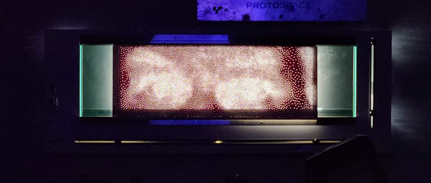
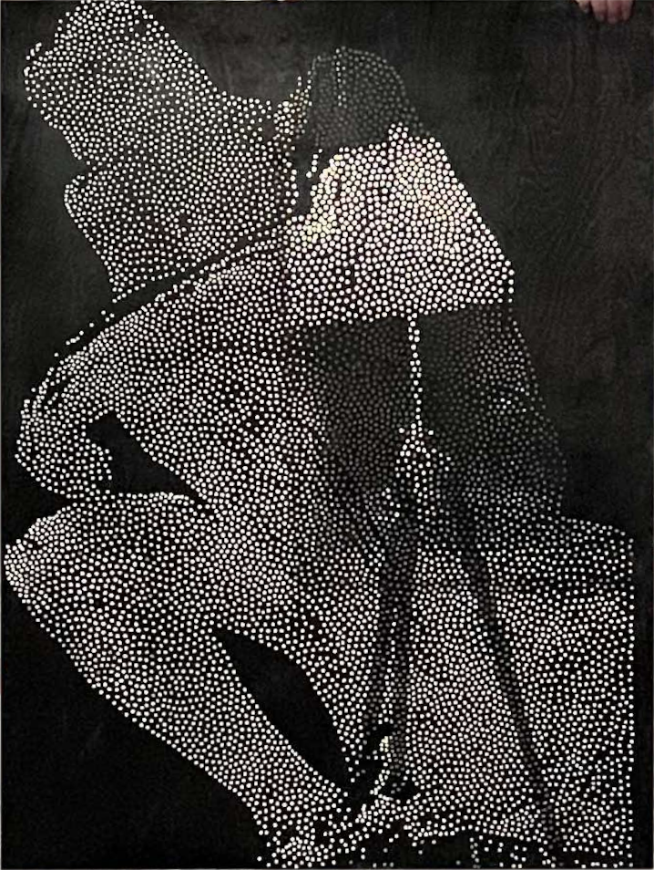
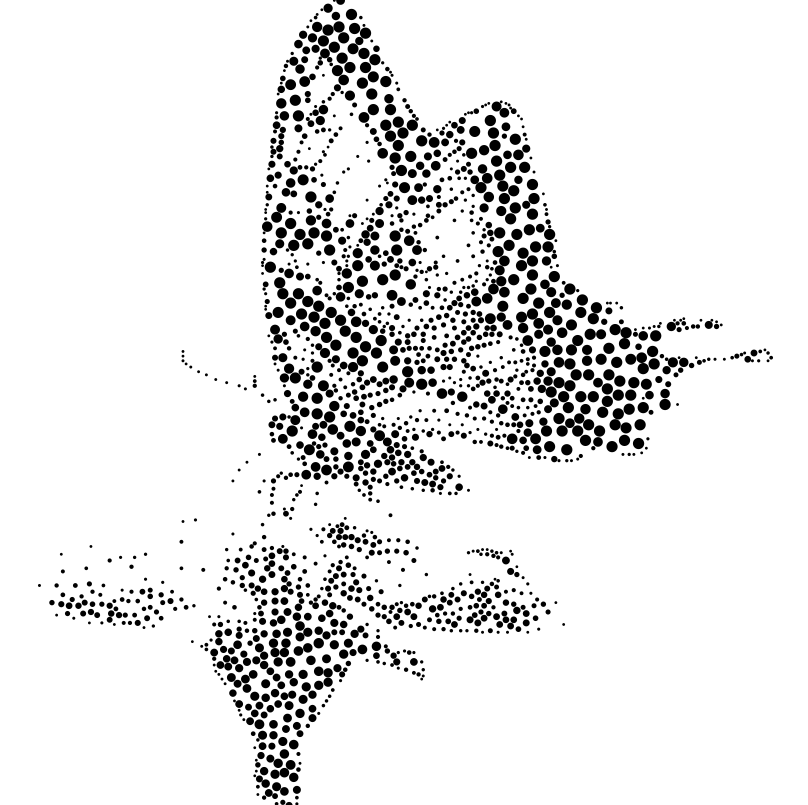
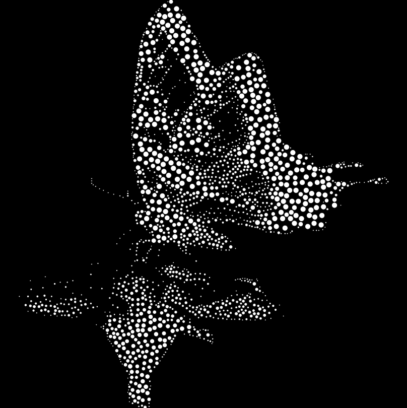
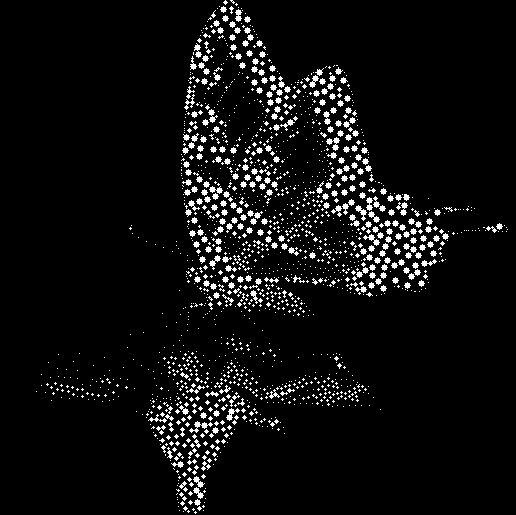
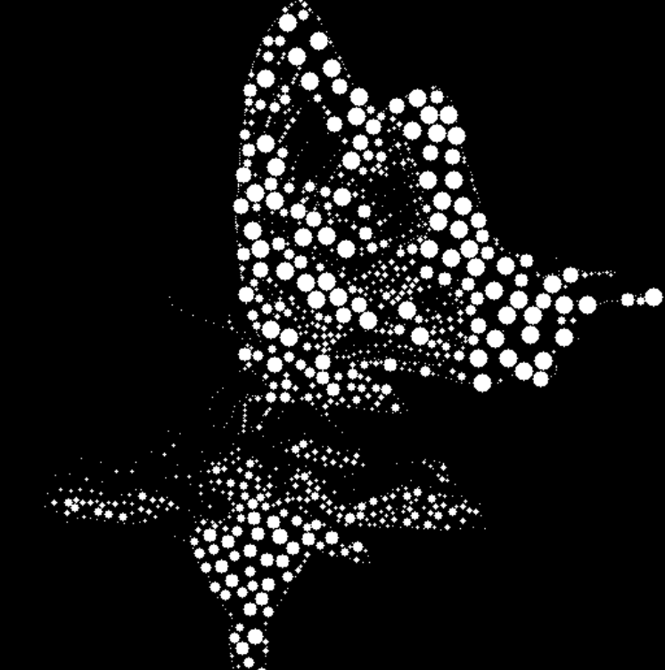
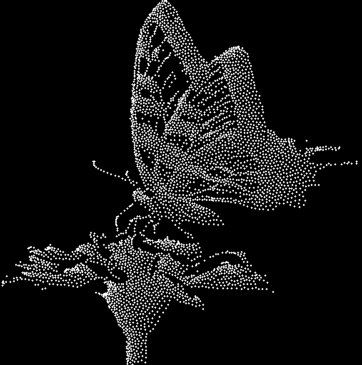
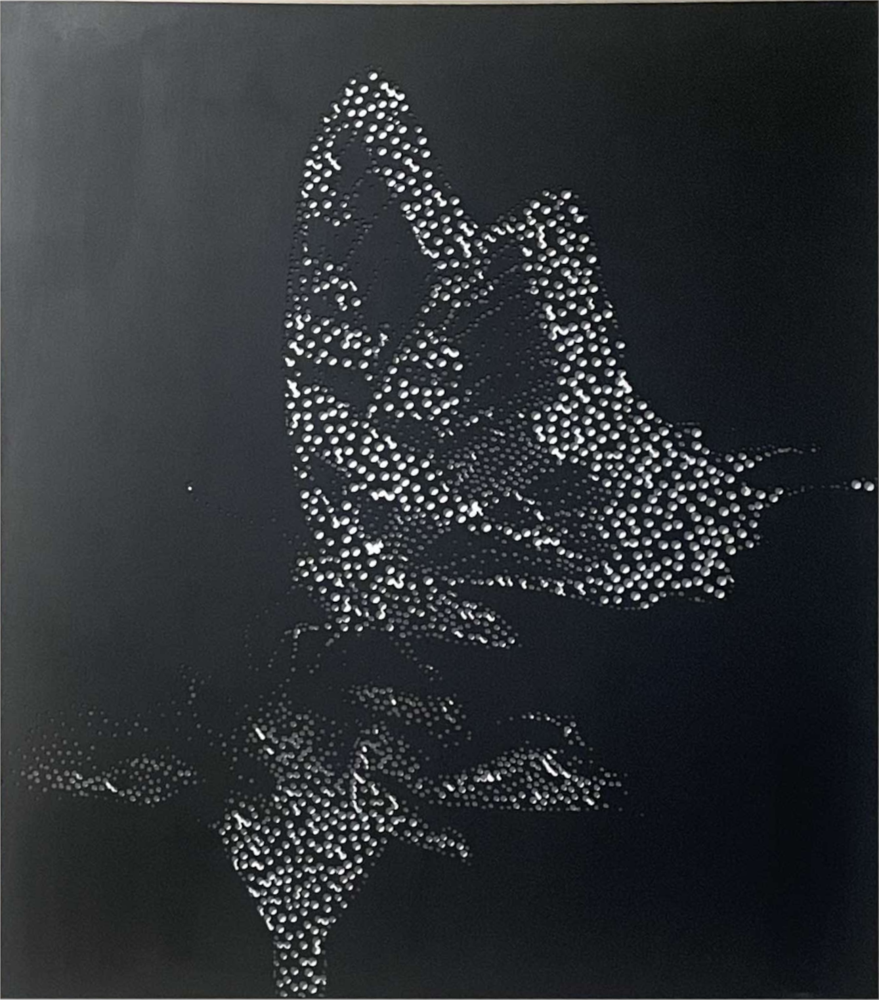

# [Genetic Stippling](https://github.com/DaviesCooper/Spattering)

*Taking weighted Voronoi stippling from screen to the laser cutter—and framing it as an evolutionary algorithm.*

If you’ve looked up “algorithmic stippling” or “Voronoi stippling,” you’ve probably run into **The Coding Train**’s video on it. It’s likely the most popular intro to the idea. Dan Shiffman walks through the same principle: take a grayscale image, treat it as a density map, and relax a set of points (Lloyd’s method / weighted centroid) so that dot *density* follows tone. Dark areas get more, closer dots; light areas get fewer. The video cites **Adrian Secord’s “Weighted Voronoi Stippling”** (NPAR 2002) as the academic reference. I used that same idea as the backbone of **[Genetic Stippling](https://github.com/DaviesCooper/Spattering)**, a project I built, and I framed the relaxation as a **genetic/evolutionary algorithm**. On top of that I had two goals the paper (and the video) don’t address, both driven by making real physical art: **variable stipple size** and **fabrication-safe output** (no “islands” when you laser-cut). This post is the comparison: what the video and paper do, what I wanted, and how the project is built around that.

---

## The Coding Train: weighted Voronoi stippling

[The Coding Train](https://www.youtube.com/@TheCodingTrain) has a video that explores this exact idea—probably more famous than the Secord paper at this point. It’s a great place to see the algorithm in action. Dan Shiffman implements weighted centroid relaxation for stippling and uses the Secord paper as a reference in the video.

<iframe width="560" height="315" src="https://www.youtube.com/embed/Bxdt6T_1qgc" title="Coding Challenge 181: Weighted Voronoi Stippling" frameborder="0" allow="accelerometer; autoplay; clipboard-write; encrypted-media; gyroscope; picture-in-picture; web-share" allowfullscreen></iframe>

*[Coding Challenge 181: Weighted Voronoi Stippling](https://youtu.be/Bxdt6T_1qgc)*

---

## Secord’s paper (the academic reference)

The video cites **Adrian Secord’s “Weighted Voronoi Stippling”** (NPAR 2002) as the go-to academic reference. Secord’s pipeline is the same idea, spelled out formally:

1. Define density as “dark = more mass”: ρ = 1 − *f* (image value).
2. Sprinkle *n* points (rejection sampling or dithering).
3. Run Lloyd’s method: build a Voronoi diagram, move each point to the *weighted* centroid of its cell, repeat until things settle.
4. Draw **circles of one constant radius** at the final positions.

Tone comes only from **where** and **how many** dots—not from dot size. The paper even says so in the future work: *“varying the size of the stipples in a single drawing”* is something they didn’t do. That was my first design constraint.

---

## Goal 1: Variable stipple size (within the same stippling)

I wanted **different sized radii within the same stippling**—bigger dots in shadow or focal areas, smaller in highlights—the kind of control you get in traditional stippling and that the paper explicitly leaves out (one constant radius per image).

So in [Genetic Stippling](https://github.com/DaviesCooper/Spattering) you pass in a **min** and a **max** radius. Within a single run, each stipple gets a radius in that range (e.g. from local image intensity: darker = larger, lighter = smaller). Tone and emphasis come from both density *and* size in one drawing, which the original method doesn’t support.

**How it’s done in code.** The generator takes **min** and **max** radius (or min/max size) as parameters. For each point in the result, its radius is computed within that range—e.g. from the image intensity at that point—so darker regions get dots closer to the max radius and lighter regions get dots closer to the min. In `exportToSVG`, each circle is written with its own `r` value (per-point radius), so a single SVG contains circles of different sizes. That’s how you get different sized stipples within the same stippling.

---

## Goal 2: No islands—stippling for laser-cut stencils

The second requirement came from **physical fabrication**. I was laser-cutting stencils: you subtractively remove material where the stipples are (cut out circles). If the pattern has a **closed loop of cuts** that fully encloses a region, that region becomes an **island**—it’s no longer connected to the rest of the sheet and falls out. Same idea as “islands” in stencil design: bounded pieces you didn’t intend to lose.

The paper doesn’t consider fabrication at all. Its output is a point set plus a constant radius, aimed at rendering on screen. I needed patterns that **don’t create those islands** so the stencil stays in one piece.

So the project is tuned for that: points only on non-white pixels, optional flow-weighted relaxation so stipples follow structure, and SVG output sized for the laser cutter. With sensible source images and parameters, you get dot distributions that work for subtractive cutting without dropping islands. I’ve cut multiple **4′ × 3′** pieces from [Genetic Stippling](https://github.com/DaviesCooper/Spattering) output; examples are below.

**How it’s done in code.** The genetic-algorithm approach and the **KD-tree** are there for Goal 2: you **prune points that overlap**. For every point, you need to check whether its stipple circle would overlap another’s; if two points are too close (circles would intersect), one is pruned. That keeps spacing and avoids dense clusters that could form enclosed regions—islands—when you cut. Checking every pair would be O(n²). The **KD-tree** speeds up the **collision check** for every point: you build a KD-tree on the point set and use it to quickly find neighbors (e.g. within a radius threshold). For each point, you query nearby points and prune if overlap is detected. So the genetic “selection” step includes both “drop points on white” and “drop points that overlap”; the KD-tree makes the overlap check feasible at scale. On top of that: initial points are seeded only on non-white pixels (`_genRandomPointsOnBlackUniformly()`), and after relaxation `_postprocess()` culls any point that landed on white, so the exported SVG only contains circles in the inked region—no cuts in the background.

---

## Evolutionary / genetic-algorithm framing

Under the hood, the relaxation loop is implemented as an **evolutionary algorithm**: a population of `numPoints` individuals (point positions), fitness defined implicitly by “did this point end up in a non-white region?”, update rule = move each point to the weighted centroid of its Voronoi cell (environment-driven, no crossover), and one selection step at the end that removes points on white. So `relaxationIterations` is literally the number of generations. If you’re used to GAs or population-based optimization, that’s the lens I use in the implementation—useful for interviews or portfolio talks when you want to highlight the AI/optimization angle.

---

## Example output

All images below live in the same directory as this article.

**Single-point laser pulses.** Stipples rendered as single-point pulses of the laser cutter (no circle cut, just a dot at each site):

**Large-scale cut piece (4′ × 3′).** Full piece cut out by the laser cutter from [Genetic Stippling](https://github.com/DaviesCooper/Spattering) SVG output:

**Radius range.** Same source image (butterfly), different `pointUnitRadius` values—smaller radius gives finer detail, larger radius gives bolder dots. I also experimented with different colors for visualizing.

  
  

  
  

**Same butterfly, cut out.** The butterfly image cut out with the laser cutter. Try to guess which stipple pattern above I used.

