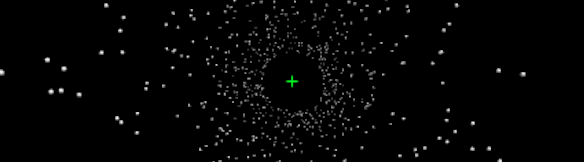
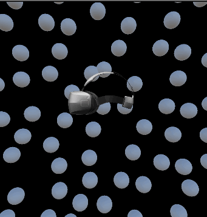

# HVV Oculus: A Research Control Panel for Vestibular Stimulation in VR

*Controlling a starfield simulation in real time while your participant is in the headset.*

A friend I used to see at the climbing gym was doing her Masters at Mount Royal University. She was talking about her research and hit a roadblock: she couldn’t find any VR apps that did visual–vestibular interaction tests—what she called a **starfield test**. We’d known each other for a while, but I’d never known she was looking and she’d never known I could build it. So I did. **[HVV Oculus](https://github.com/DaviesCooper/HVVOculus)** is that app.

Studying **vestibular stimulation** in virtual reality means you need more than a pre-recorded experience. You need to change what the participant sees—and when they see it—while they’re already immersed. That’s what the tool is built for: a desktop control panel that lets researchers drive a configurable particle simulation in real time, with the participant wearing an Oculus Quest and seeing nothing until the researcher decides to push the current setup to the headset.

The participant puts on the headset after the app is running. From their perspective, the world is black. On the researcher’s machine, the same Unity build shows a preview of the simulation and a full set of sliders, toggles, and inputs. You tweak particle count, size, speed, and a bunch of other parameters; the preview updates immediately. When you’re ready, you click **Send to Headset**. Only then does the participant see the current stimulus. That separation—preview and control on the PC, display gated by a single action in the headset—is the core of the workflow.

---

## Why a control panel?

In many VR experiments you bake everything into a build: fixed scenes, fixed timings. For vestibular and visual–vestibular work, researchers often want to:

- Try different stimulus configurations without rebuilding.
- Adjust parameters in response to the participant (e.g. comfort, task difficulty).
- Replicate or slightly vary a previous run by loading saved settings.

HVV Oculus treats the stimulus as a **parameterized particle field**: number of particles, their size, where they’re allowed to spawn, how fast they move, how far they travel, and several display options (floor, crosshairs, a central/peripheral vision mask). Changing a “generation” parameter (e.g. count, radius, generation volume) creates a new random layout; changing “runtime” parameters (e.g. velocity, travel length, mask) only affects behavior, not the current set of particle positions. So you get a middle ground between fully scripted and fully ad‑hoc: structured, reproducible parameters, but controllable in real time from one place.

---

## Two views, one set of parameters

Under the hood the app maintains **two** instances of the same simulation idea:

1. **Preview** — Rendered on the researcher’s monitor so they can see exactly what they’re configuring (particle cloud, motion, mask, etc.).
2. **Headset** — Rendered in the Quest (over Link). It starts with the same parameters but doesn’t update until **Send to Headset** is pressed.

So the researcher always sees the “next” state; the participant only sees what has been explicitly sent. That’s implemented by having two **ParticleManager**-style setups (one for preview, one for headset) and a single **ParticleUIManager** that holds the canonical parameter set. Sliders and toggles update the preview in real time via events; **Send to Headset** copies that same set into the headset pipeline and triggers a **SerialManager** signal (e.g. to an Arduino or other hardware) so the lab can sync external equipment if needed.

---

## What you can actually control

The README and in-app UI spell out the full list; here’s the short version. All of these controls exist because they were asked for—the design followed the research needs, not the other way around.

**Generation parameters** (change these → new random particle layout):

- **Number of particles**, **particle radius**, **generation radius/length**, **exclusion radius** — How many particles, how big they are, and the cylindrical volume they’re randomly placed in (with an inner “no spawn” cylinder).

**Runtime parameters** (no regeneration, just behavior/display):

- **Velocity**, **travel length** — How fast particles move and between which bounds (e.g. back and forth along the main axis).
- **Fix camera** — Whether the particle field moves with the head (camera) or stays in world space.
- **Show floor**, **show crosshairs** — Extra visual reference.
- **Mask (CoV)** — A circular mask (radius 0–1, invertible) so you can occlude center or periphery; useful for studies that care about where in the visual field the stimulus appears.

Everything is in physical-ish units (meters, m/s) so you can reason about spatial and temporal scale when designing protocols.

<em>Example of the starfield stimulus: particles moving along the travel axis (velocity and travel length set via the control panel).</em>

---

## How it’s wired: DemoManager, UI, and “Send to Headset”

The glue is **DemoManager**. It:

- Owns references to the **Preview** and **Headset** particle managers and the **ParticleUIManager**.
- Subscribes to the UI’s events (e.g. `numberOfParticlesChangedEvent`, `velocityChangedEvent`, `maskRadiusChangedEvent`). When a generation parameter changes, it calls `PreviewManager.Reset(...)` (or the appropriate `Set*` for runtime-only changes). So the preview always reflects the current form state.
- On **Send to Headset**, calls `serialManager.sendSignal()` (e.g. serial “A” to an Arduino) and then `HeadsetManager.Reset(...)` with the same parameter bundle the UI holds. So one click updates both the headset view and any external sync.

Save/Load use the same parameter set: **ParticleUIManager** serializes to a comma-separated string (and optionally to a `.test` file via a file browser). Loading parses that string and pushes values back into the UI, which fires the same events, so the preview (and, if you click Send to Headset, the headset) end up in the same state as the saved run. That makes it easy to reuse or slightly tweak a previous condition.

---

## Tech stack in one sentence

**Unity** (C#), **GPU Instancer** for drawing large particle counts efficiently, **Oculus/OpenXR** for the Quest, **Simple File Browser** for choosing save/load paths, and a **SerialPort** bridge so “Send to Headset” can trigger external hardware. The headset and desktop run the same build; the “control panel” is just the same scene with a preview camera and UI, and the participant’s view is updated only when you choose.

---

## Who it’s for

HVV Oculus is for researchers who need **live control** of a VR particle-field stimulus—especially for vestibular or visual–vestibular studies—with a clear split between “what the operator sees and edits” and “what the participant sees.” If that matches your protocol, the [releases](https://github.com/DaviesCooper/HVVOculus/releases) give you a ready-made executable; connect the Quest via Link, run the app, put the participant in the headset, and drive everything from the PC. And if something goes wrong, the app writes **SendToCooperIfAnythingGoesWrong.log** so you have a concrete trace to share or debug with.

---

## From the climbing gym to Nepal (and into print)

So what happened after the app was built? The software got loaded onto a headset, went with the research team to Nepal, and was used in the field as part of a high-altitude expedition. The same Mount Royal University lab that had hit the roadblock (and that had specified every feature) took the Quest, ran HVV Oculus in conditions that would have been impossible in a traditional lab: low altitude in Kathmandu (1400 m) and high altitude after a multi-day trek (4300 m in Pheriche). The study compared vestibular-evoked balance responses in lowlanders and Tibetan highlanders at both elevations, and the starfield stimulus delivered by the app was part of the protocol. That work has since been published. If you want to see the research that the tool was built for—and that it actually ran in—the paper is here: **Applied Physiology, Nutrition, and Metabolism** (2025), [dx.doi.org/10.1139/apnm-2025-0191](https://dx.doi.org/10.1139/apnm-2025-0191). Not bad for something that started as a conversation at the climbing gym.

